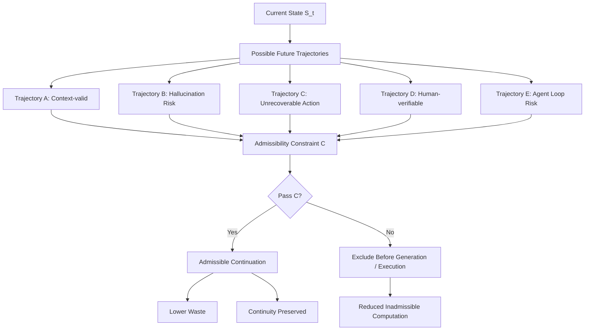

# Figure 2: Admissible Future Selection Flow



## Description

This figure illustrates Admissible Future Selection.

Instead of generating all possible futures and filtering afterward, I2OS evaluates possible trajectories through an admissibility constraint before generation or execution.

Trajectories that are context-invalid, unsafe, unrecoverable, unsynchronized, future-incompatible, human-unverifiable, or computationally wasteful are excluded before they expand into downstream cost.

## Core Message

```text
The most efficient computation is computation that never needed to happen.
```
