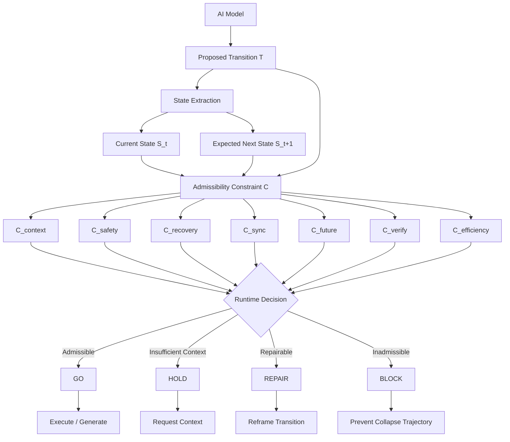

# Figure 3: I2OS Runtime Gate Model



## Description

This figure shows the I2OS Runtime Gate.

A proposed AI transition is evaluated before generation or execution. The system extracts the current state, estimates the expected next state, and checks the transition against multiple admissibility constraints.

The output is classified as GO, HOLD, REPAIR, or BLOCK.

This allows AI systems to reduce unnecessary computation, prevent unsafe transitions, and preserve continuity.

## Core Equation

```text
Permit(T)=1[C(S_t,T,S_{t+1})=1]
```

## Core Message

```text
Capability is not permission.
```
