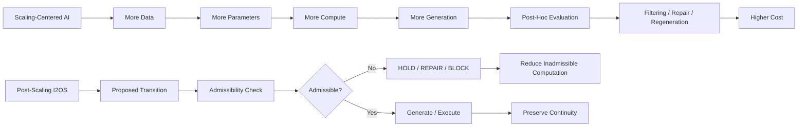

# Figure 1: Scaling AI vs Post-Scaling I2OS



## Description

This figure contrasts the scaling-centered AI paradigm with the I2OS post-scaling efficiency approach.

Scaling-centered AI expands capability through more data, more parameters, more compute, and more generation. However, this often leads to post-hoc filtering, repair, regeneration, and increased operational cost.

I2OS shifts the focus from generating more to excluding inadmissible futures before generation or execution. By checking admissibility before computation expands, I2OS reduces unnecessary computation and preserves continuity.

## Core Message

```text
Scaling expands capability.
I2OS constrains capability into admissible trajectories.
```
